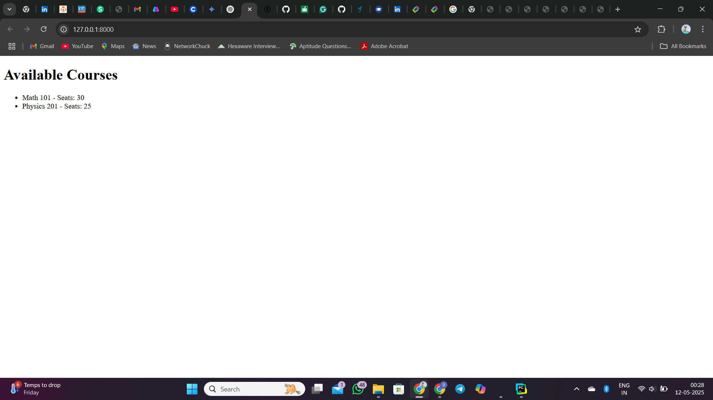
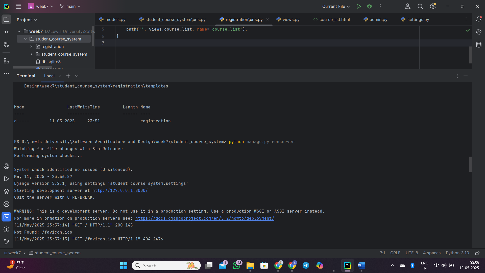
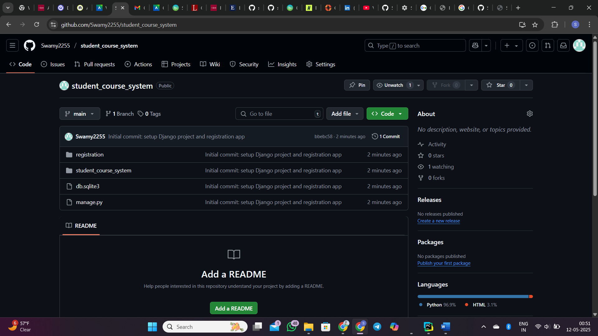

🎓 Student Course Registration System

This Django-based project simulates a simplified student course registration system. It allows students to view available courses and their seat availability. This is an ongoing academic project for the **Software Architecture and Design** course at Lewis University.

---

## ✅ Features Implemented (40%)

- Display available courses with seat counts.
- Django framework setup and basic project structure.
- Static course data rendered using Django templates.

---

## 🔧 Setup Instructions

1. **Clone the repository:**
   ```bash
   git clone https://github.com/Swamy2255/student_course_system.git
   cd student_course_system
2. **Create and activate a virtual environment:**
   ```bash
   python -m venv venv
   venv\Scripts\activate   # On Windows
3. **Install dependencies:**
   ```bash
   pip install django
4. **Run the server:**
   ```bash
   python manage.py runserver
5. **Access the app in your browser:**
   ```cpp
   http://127.0.0.1:8000/
   
**📚 Use Cases (Phase 3)**
| Use Case     | Description                                         |
| ------------ | --------------------------------------------------- |
| View Courses | A student can view a list of all available courses. |

Planned use cases for future phases:
•	Student registration/login
•	Course enrollment
•	Admin adding/removing courses

**📸 Screenshots**
## Screenshots

### Available Courses Page


### Django Server Running


### GitHub Repository Overview



**🚀 Technologies Used**
•	Python 3.13
•	Django Web Framework
•	SQLite (Default DB)
•	HTML (Django Templates)
•	Git & GitHub

**📅 Project Timeline**
| Phase       | Description                           | Status         |
| ----------- | ------------------------------------- | -------------- |
| Phase 1     | Project idea and overview             | ✅ Completed    |
| Phase 2     | System requirements and planning      | ✅ Completed    |
| Phase 3     | 40% of working implementation         | ✅ In Progress  |
| Final Phase | Fully functional system with features | 🔜 Coming Soon |

**👩‍💻 Developer**

Swamy Gorla

Graduate Student – Master of Computer Science

Lewis University

© 2025 Swamy Gorla – Lewis University
