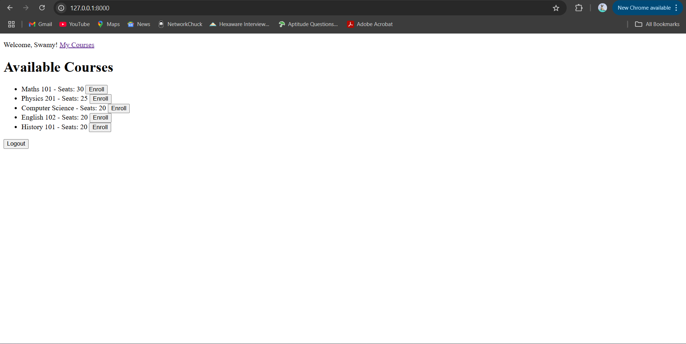

🎓 Student Course Registration System

## 📝 Project Overview

This is a Django-based web application that allows students to browse available courses, enroll in them, view their registered courses, and drop courses as needed. The system uses Django’s built-in authentication and admin features, making it secure and easy to manage for both students and administrators.

---

## 🚀 Features
✅ User registration and login/logout

✅ View list of available courses with seat availability

✅ Enroll in courses

✅ View enrolled courses

✅ Drop enrolled courses

✅ Admin dashboard for managing courses and enrollments

✅ Success messages for user actions

✅ Secure form handling with CSRF protection

---

## 🛠️ Technologies Used
Python 3.13

Django 5.2

SQLite (Default DB)

HTML/CSS (Django Templates)

Django Admin Interface

## 🔧 Setup Instructions

1. **Clone the repository:**
   ```bash
   git clone https://github.com/Swamy2255/student_course_system.git
   cd student_course_system
2. **Create and activate a virtual environment:**
   ```bash
   python -m venv venv
   venv\Scripts\activate   # On Windows
3. **Install dependencies:**
   ```bash
   pip install django
4. **Run migrations:**
   ```bash
   python manage.py makemigrations
   python manage.py migrate
5. **Create a superuser:**
   ```bash
   python manage.py createsuperuser
6. **Start the development server:**
   ```bash
   python manage.py runserver

7. **Access the app in your browser:**
   ```cpp
   Main app: http://127.0.0.1:8000/
   Admin panel: http://127.0.0.1:8000/admin/
   
**📚 Use Cases**
| Use Case     | Description                                         |
| ------------ | --------------------------------------------------- |
| View Courses | A student can view a list of all available courses. |
| Enroll Courses | A student can enroll the avilable courses.        |
| Drop Courses | Student can drop from the enrolled courses.         |


**📸 Screenshots**
## Screenshots


### 📸 Screenshots

#### 📘 Course List Page


#### 🧾 Enrolled Courses Page


#### Enrollment Confirmation


#### ❌ Drop Confirmation


#### 🛠️ Admin Panel (Courses)


**📅 Project Timeline**
| Phase       | Description                           | Status         |
| ----------- | ------------------------------------- | -------------- |
| Phase 1     | Project idea and overview             | ✅ Completed    |
| Phase 2     | System requirements and planning      | ✅ Completed    |
| Phase 3     | 40% of working implementation         | ✅ Completed  |
| Final Phase | Fully functional system with features | ✅ Completed |

**👩‍💻 Developer**

Swamy Gorla

Graduate Student – Master of Computer Science

Lewis University

© 2025 Swamy Gorla – Lewis University
